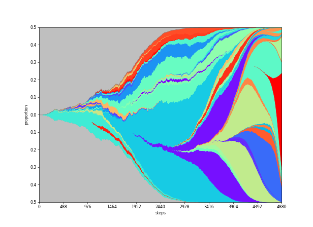
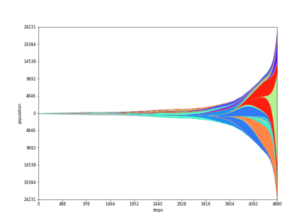
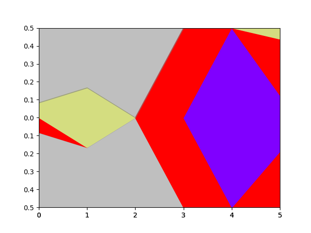
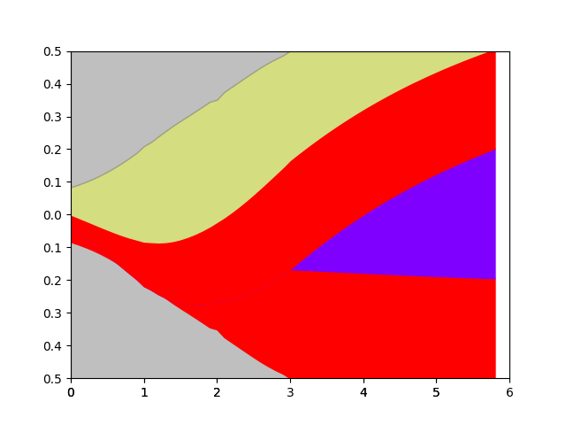
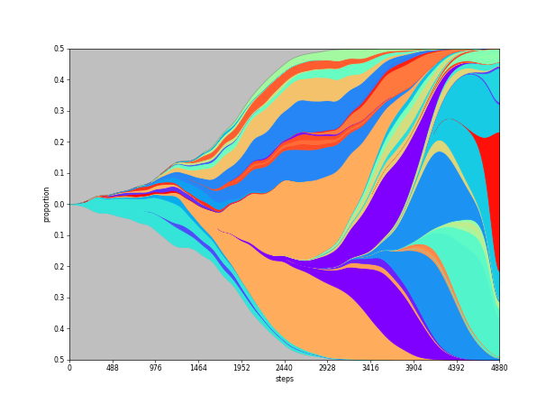

# PyFish

PyFish is a Python package for creation of [Fish (Muller) plots](https://en.wikipedia.org/wiki/Muller_plot) like this one:


### Primary features
* polynomial interpolation
* curve smoothing
* high performance
* works with low and high density data

## Installation

PyFish requires Python >= 3.8

The package can be installed using Pip:

```
pip install PyFish
```

## Input

The program takes two tables:
* one describing the size of individual subgroups at given points in time, referred to as _populations_,
* one describing the parent-child relationships between the subgroups, referred to as _parent tree_.

### Populations

Populations table has the schema `(Id: +int, Step: +int, Pop: +int)`, where:
* `Id` is a numerical identifier of a subgroup`,
* `Step` is a natural ordinal describing the logical time when the population is measured,
* `Pop` is the size of the population of the subgroup at the given step.

An example populations table:

| Id  | Step | Pop |
|-----|------|-----|
| 0   | 0    | 100 |
| 0   | 1    | 40  |
| 0   | 2    | 20  |
| 0   | 3    | 0   |
| 1   | 1    | 10  |
| 1   | 3    | 50  |
| 1   | 5    | 100 |
| 2   | 4    | 20  |
| 2   | 5    | 50  |
| 3   | 0    | 10  |
| 3   | 1    | 20  |
| 3   | 5    | 10  |

### Parent Tree

Parent tree has the schema `(ParentId: +int, ChildId: +int)`, where:
* `ParentId` is an id matching the population table,
* `ChildId` is an id matching the population table describing the direct progeny of the parent.

An example parent tree:

| ParentId | ChildId | 
|----------|---------|
| 0        | 1       |
| 1        | 2       |
| 0        | 3       | 

**Note: there must be exactly one node in the parent tree that has no parent. This is the root (0 in the example above).**

## Execution

PyFish can be used either as a stand-alone tool or as a plotting library.

### Tool 

We provide example data. From the root folder of the project call: 

`pyfish tests/populations.csv tests/parent_tree.csv out.png`

This will create a plot called `out.png` in the folder. 

### Library


## Parameters

### `-a, --absolute`

Plots absolute population counts at each step.

| Base                          | --absolute                       |
|-------------------------------|----------------------------------|
|  |  |

###  `-I, --interpolate int`

Fills in missing values by interpolation by a polynomial of the given degree. 
If a value is not given, each population is set to 0 at the first and last step.

| Base                          | --interpolate 2                                |
|-------------------------------|------------------------------------------------|
|  |  |

* `-S float`

| Base                          | --smooth = 50                       |
|-------------------------------|-------------------------------------|
|  |  |

* `-F int+`, `-L int+`
* `-M string`
* `-R int+`
* `-W int+`, `-H int+`


## Contact
Email questions, feature requests and bug reports to Adam Streck, adam.streck@mdc-berlin.de.

## License
PyFish is available under the MIT License.

## Please cite
TODO